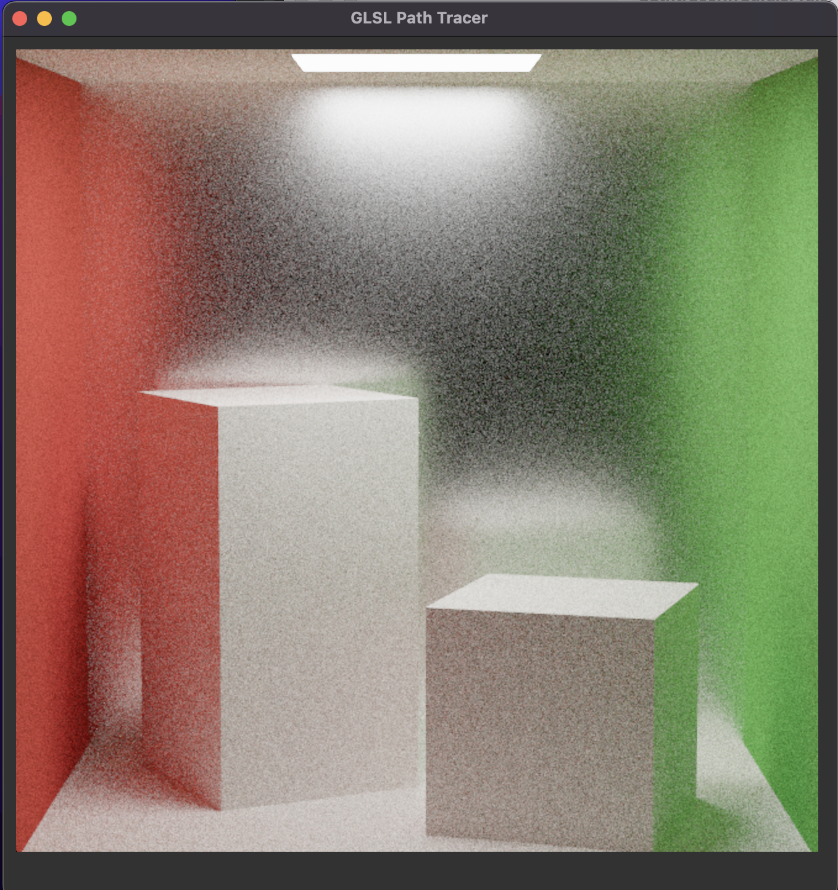
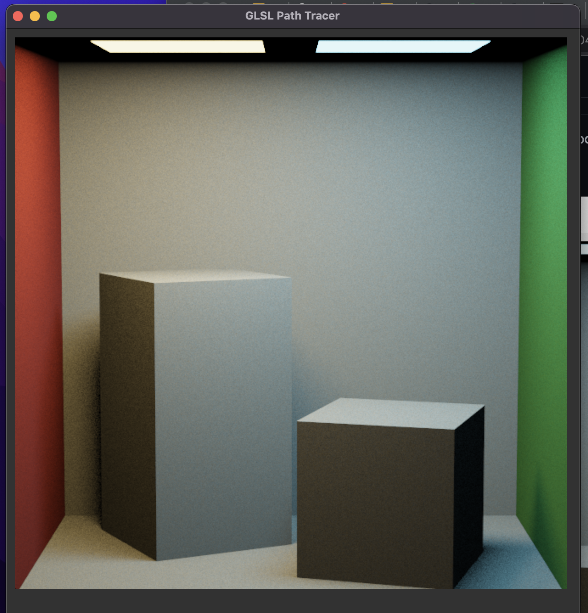
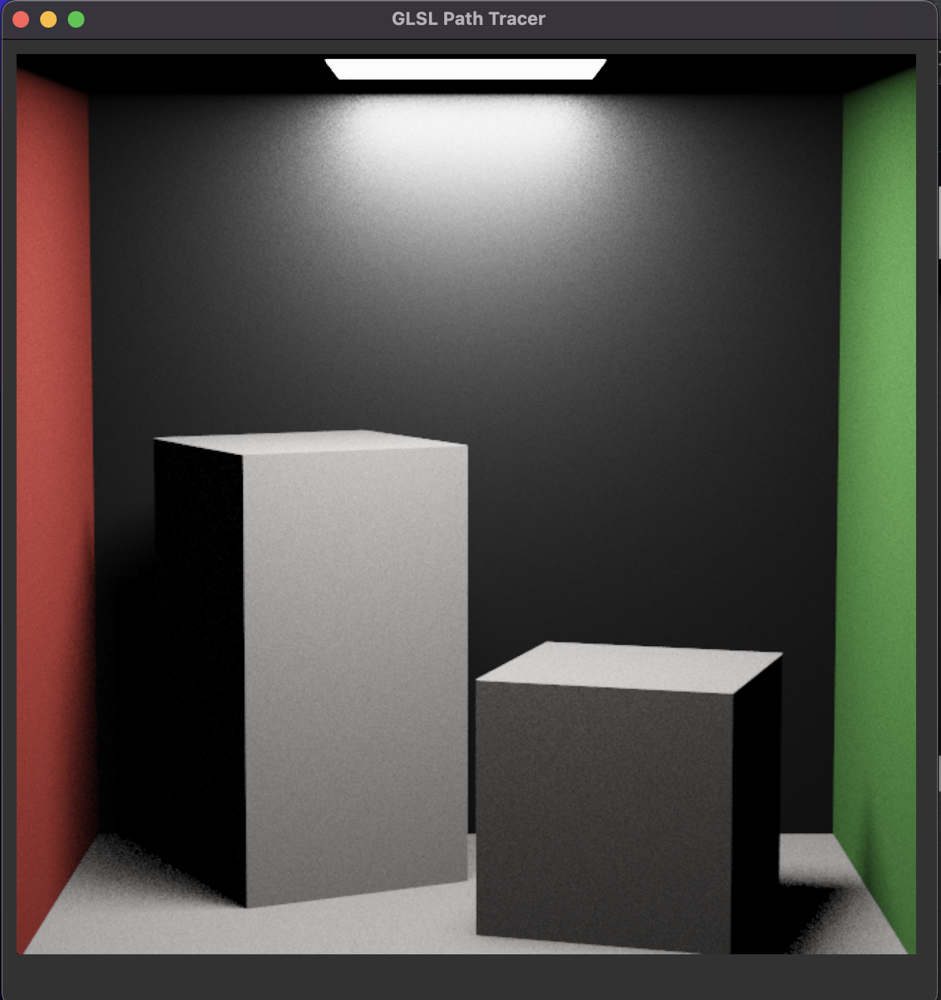
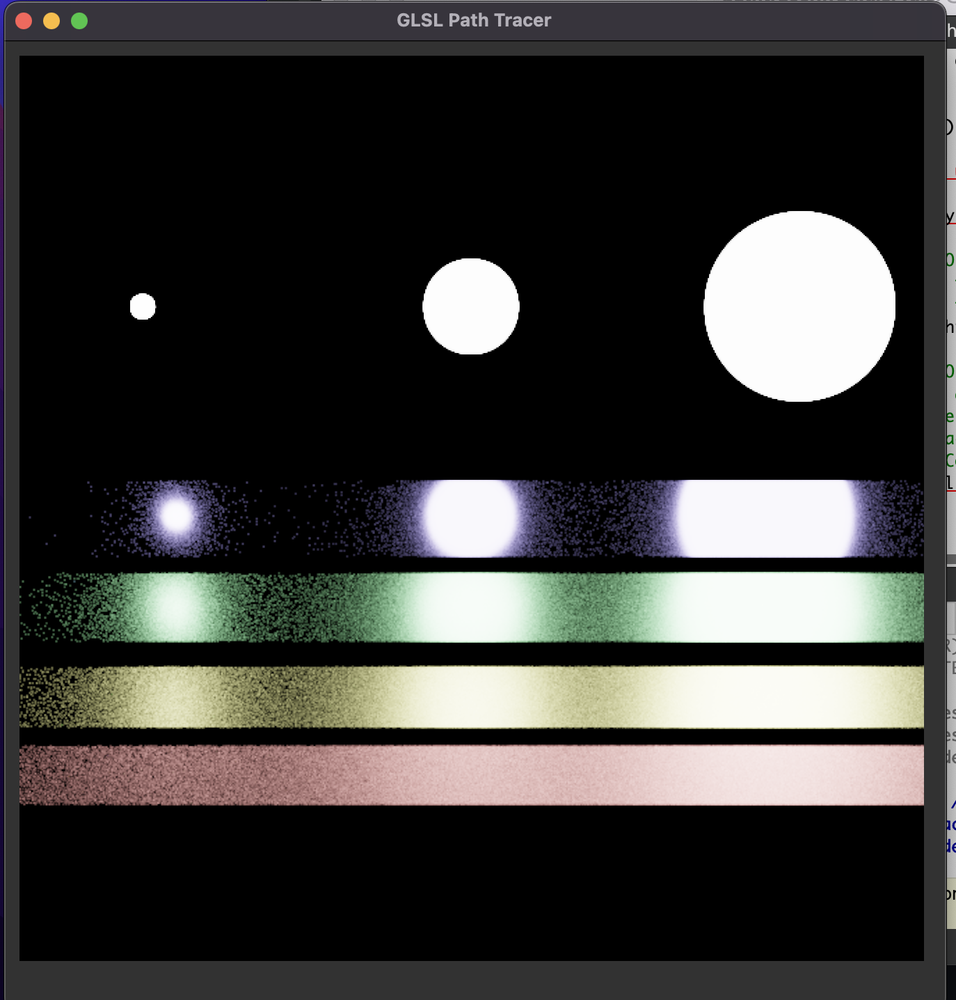
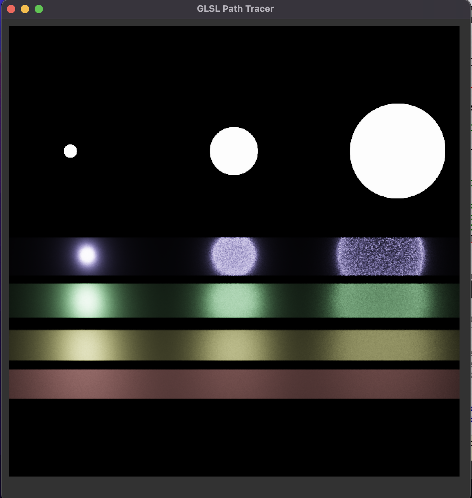
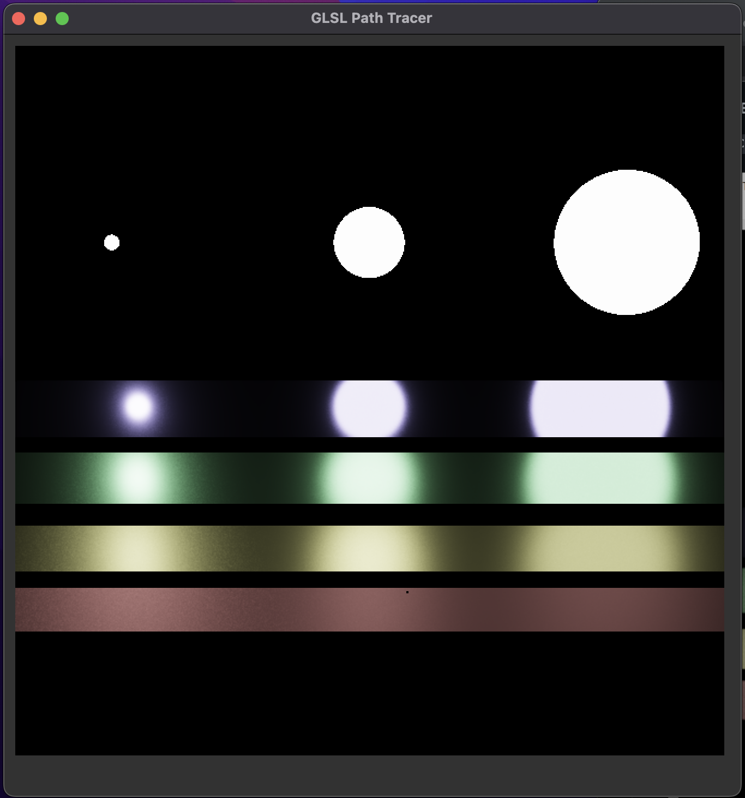

Path Tracer Part III: Multiple Importance Sampling and Microfacet Materials
======================

**University of Pennsylvania, CIS 561: Advanced Computer Graphics, Homework 4**

Claire Zhang
------------
Here are my renders:
------------
Rough Mirror Box Uniform with Li Naive

Two Lights Boxes with MIS

Rough Mirror Box Uniform with MIS

Veach Scene with Li Naive

Veach Scene with Li Direct 

Veach Scene with MIS

