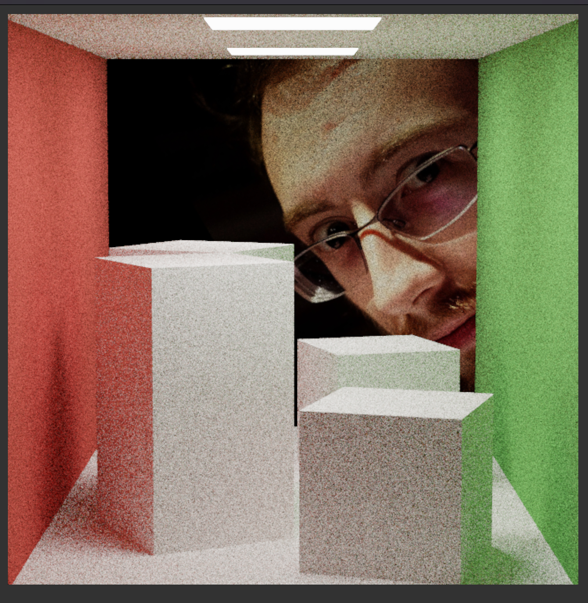
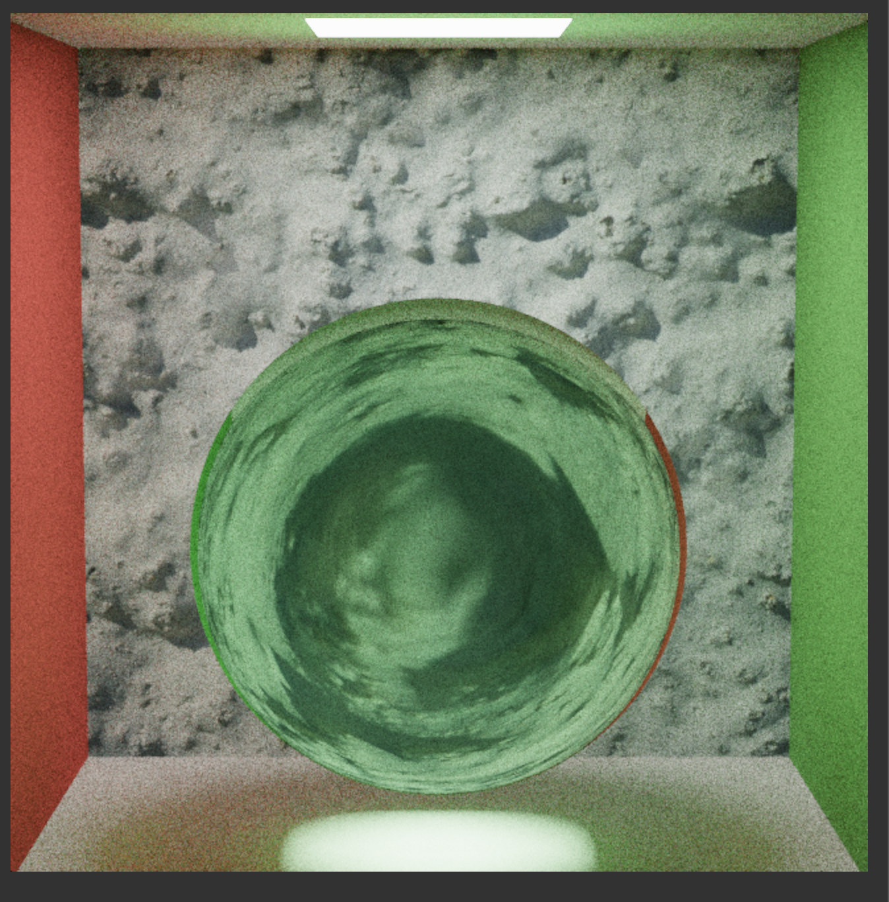
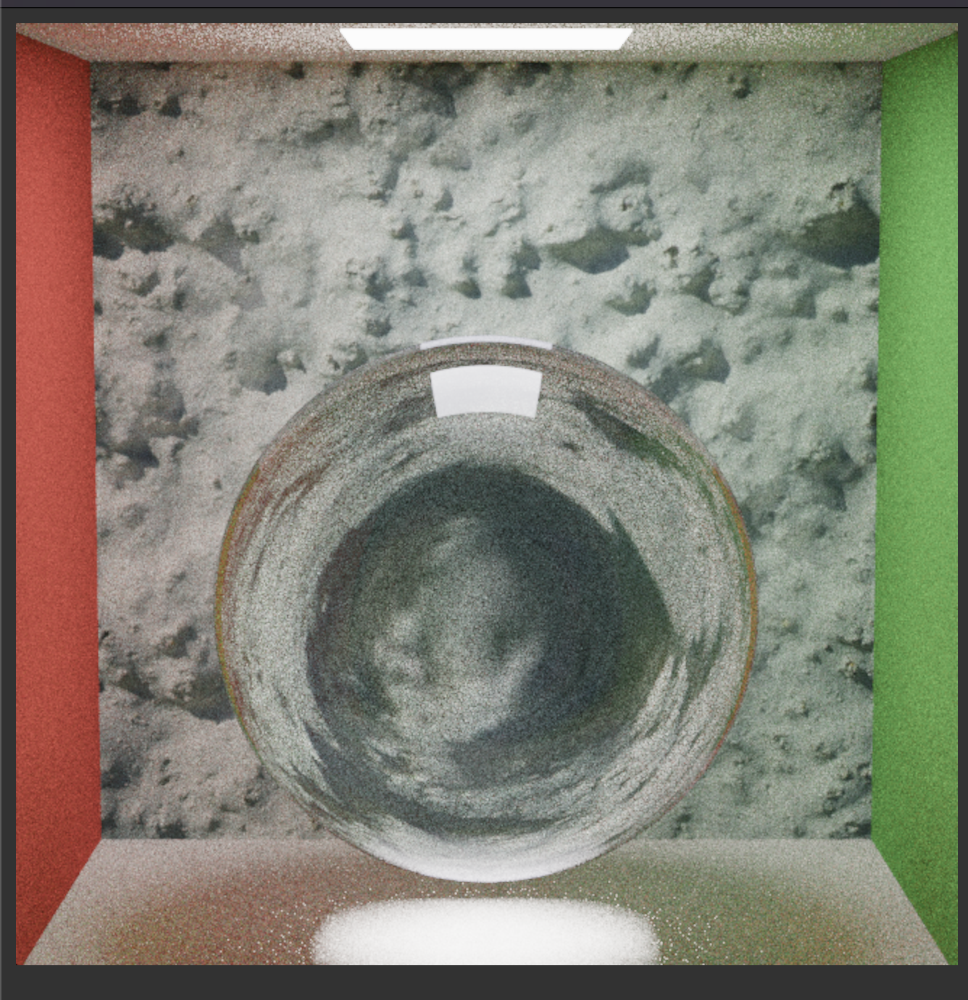
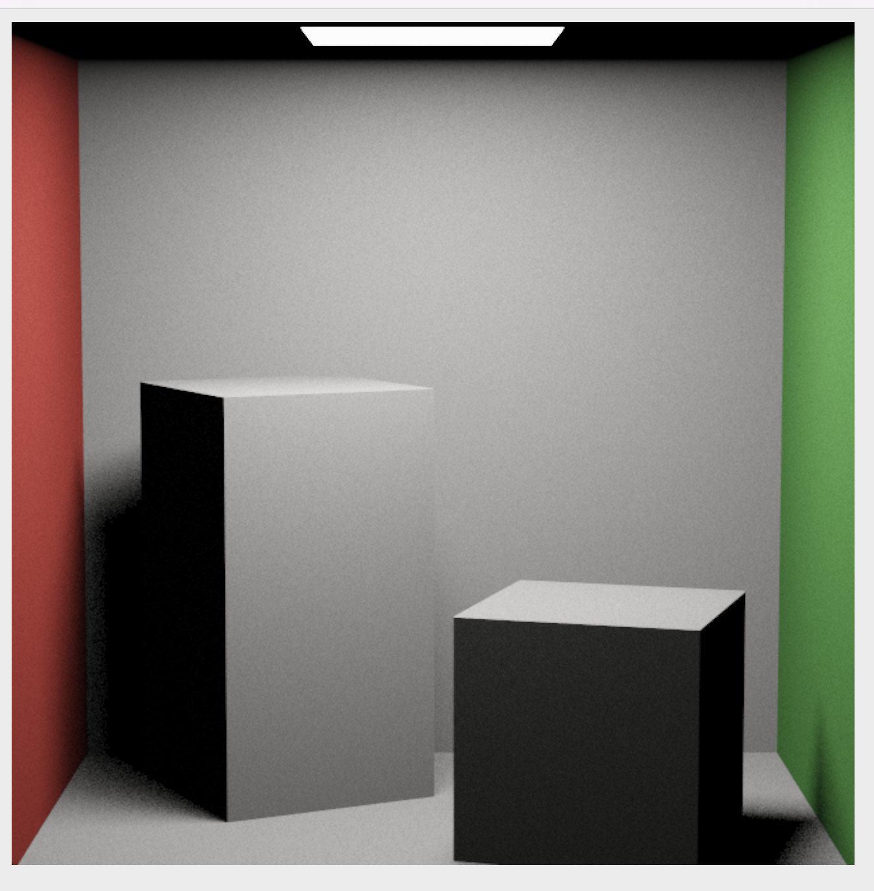
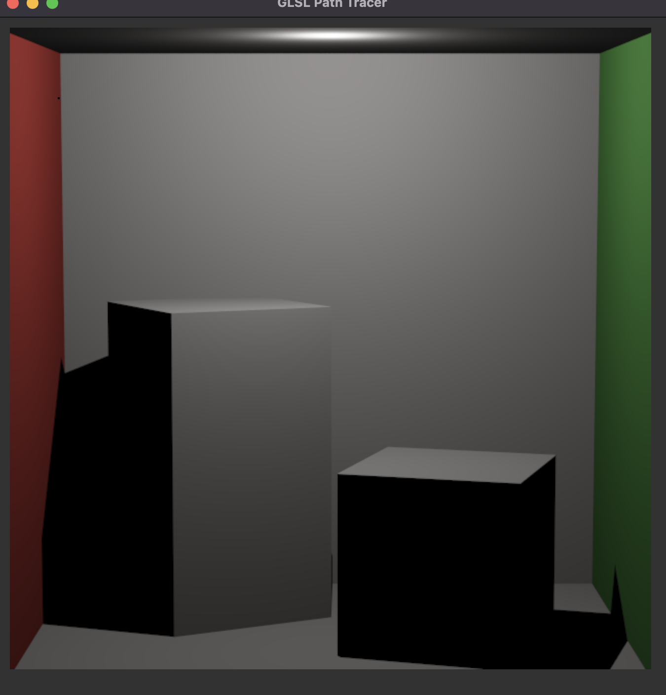
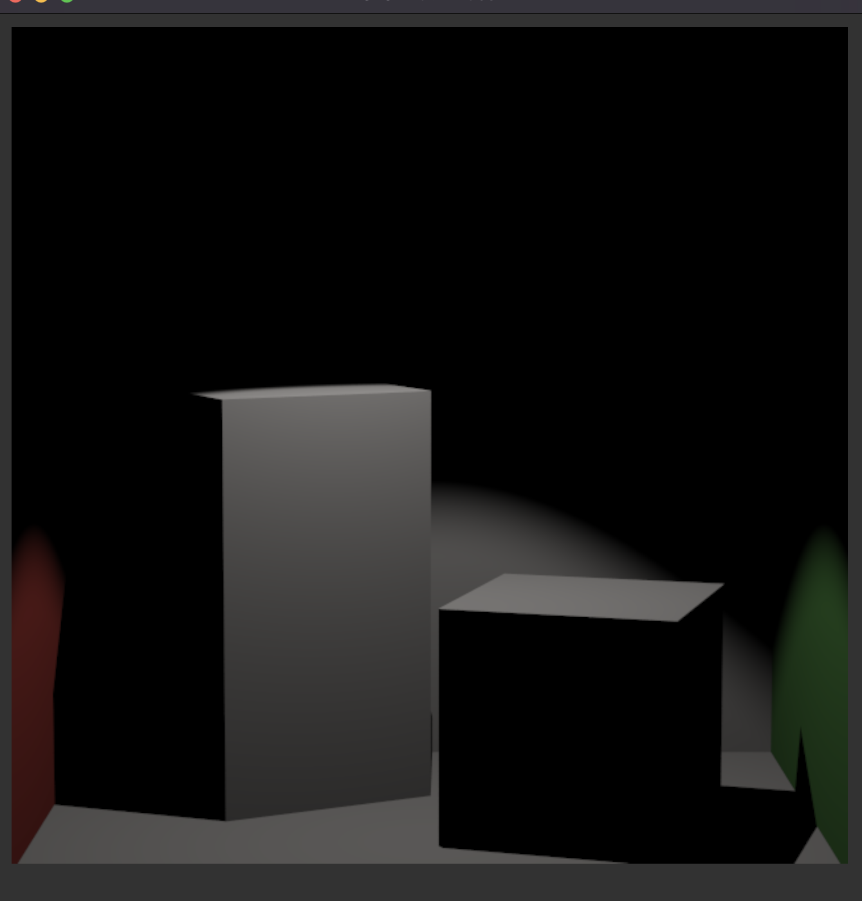
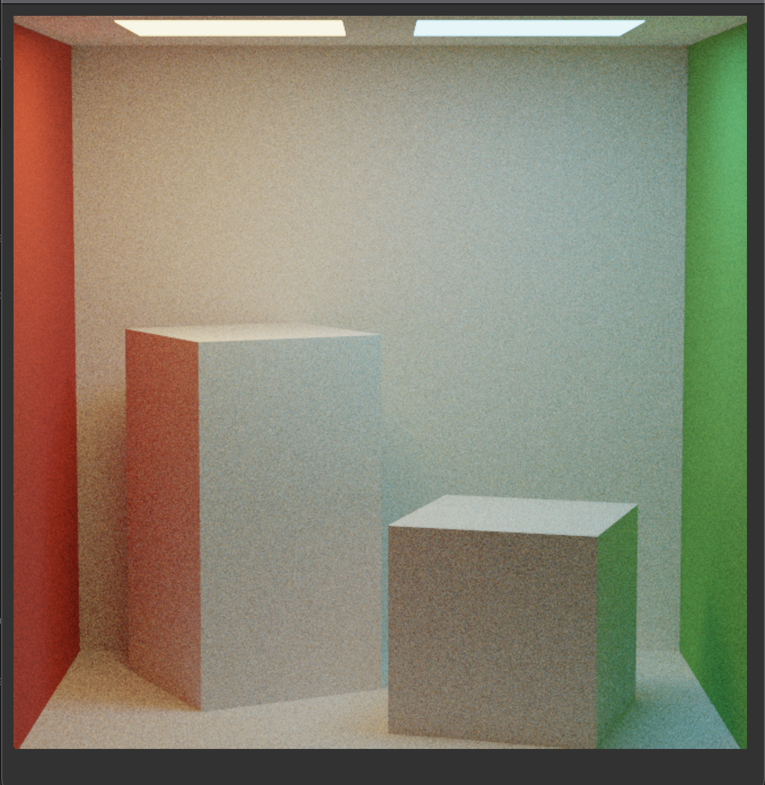
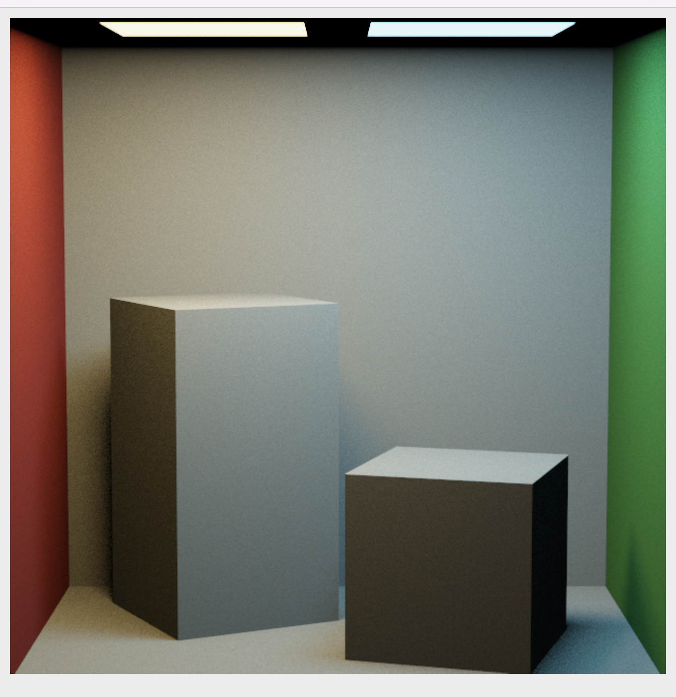

Path Tracer Part II: Direct Lighting Estimation and Specular Materials
======================

**Claire Zhang | czhangz | using late day ._.**

-------------
**Here are my renders!**
------------

Mirror Box

Transmit Box

Glass Box

Area Light

Point Light

Spotlight

Two Lights li_naive

Two Lights li_direct

