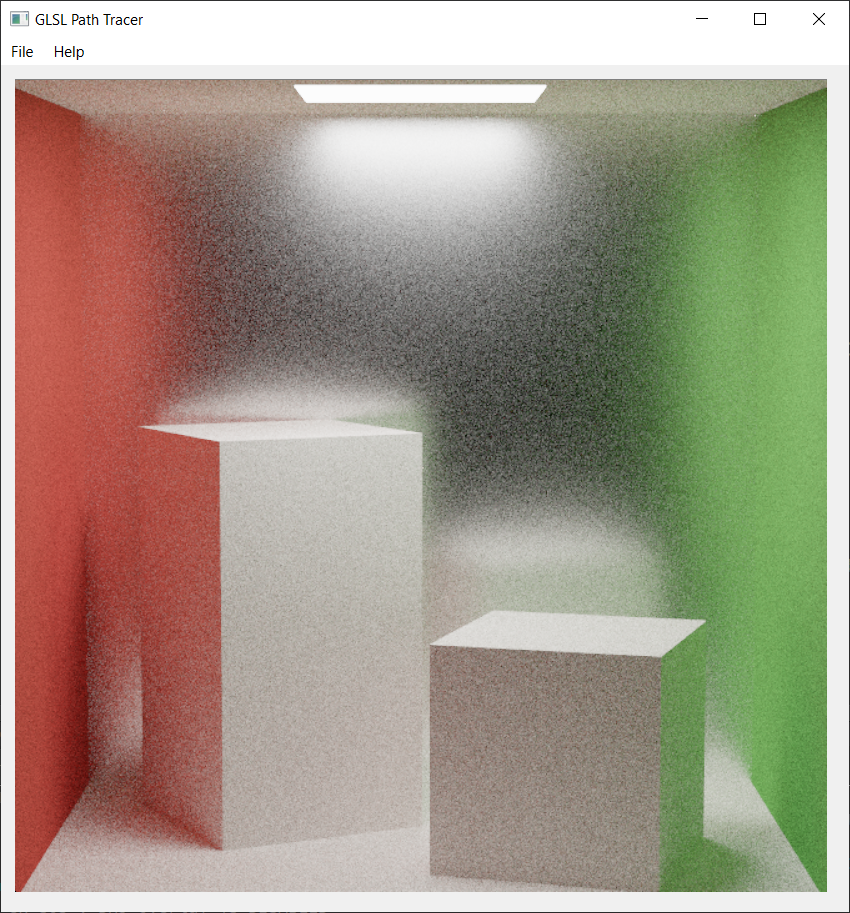
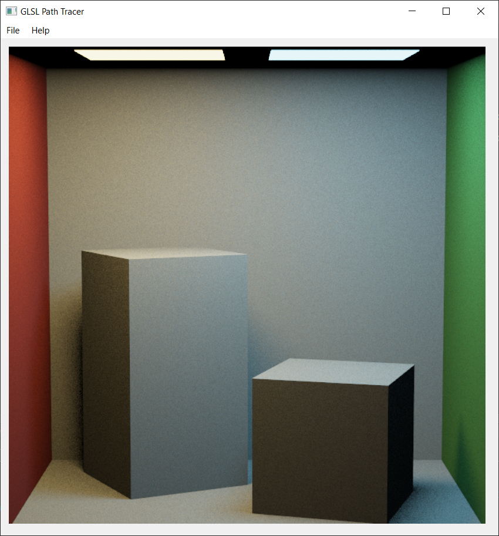
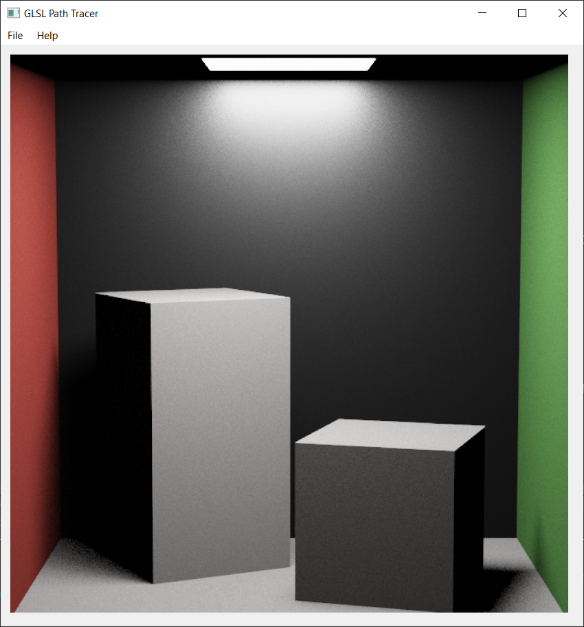
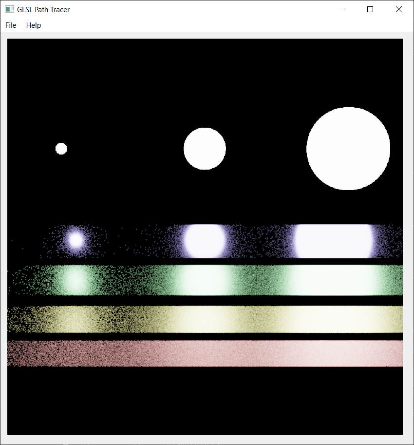
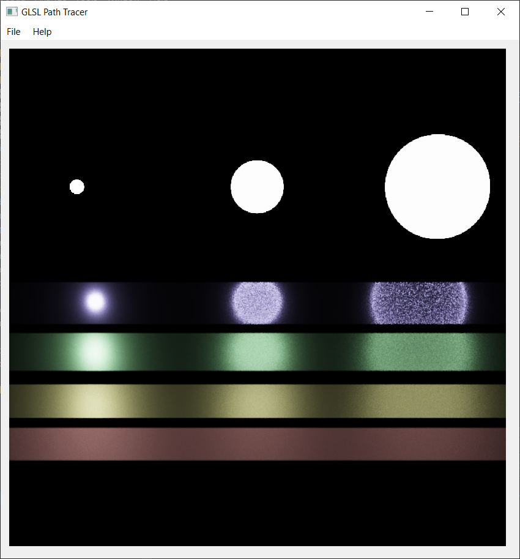
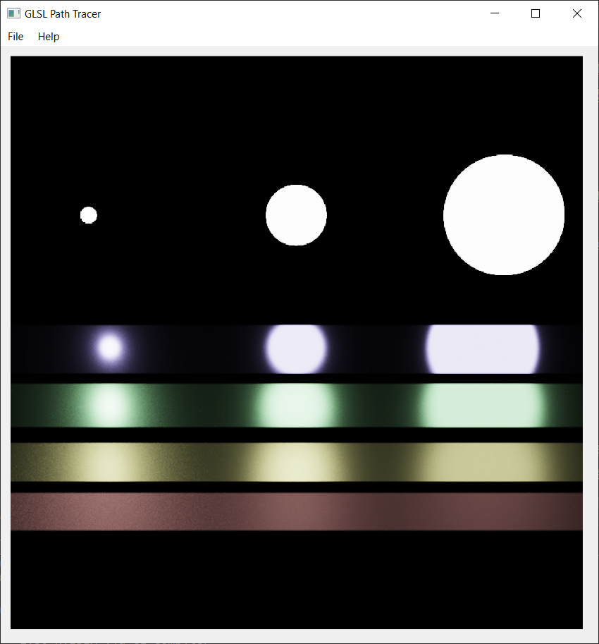

Path Tracer Part III: Multiple Importance Sampling and Microfacet Materials
======================

**University of Pennsylvania, CIS 561: Advanced Computer Graphics, Homework 4**

Overview
------------
You will implement another `Li` function in order to use multiple importance
sampling to better estimate the direct illumination received by points in your scene.
You will test this integrator on the provided Veach scene files, which incorporate
microfacet surfaces of varying roughness and light sources of varying size.

Provided Code
-------
We have provided you with updated and new files for your existing path tracer
base code. Please copy your existing files into the folder containing your `.pro` file,
but __DO NOT__ replace any of the files we have provided with this assignment.
For some of your files, you may have to add function implementations to
various files to make your project compile again. However, just to re-iterate,
it is vital that you __DO NOT__ replace any of the files we have given you
for this assignment.

Useful Reading
---------
Once again, you will find the textbook will be very helpful when implementing
this homework assignment. We recommend referring to the following chapters:
* 8.4: Microfacet Models
* 9.2: Material Interface and Implementations
* 13.10: Importance Sampling

The Light Transport Equation
--------------
#### Lo(p, &#969;o) = Le(p, &#969;o) + &#8747;S f(p, &#969;o, &#969;i) Li(p, &#969;i) V(p', p) |dot(&#969;i, N)| _d_&#969;i

* __Lo__ is the light that exits point _p_ along ray &#969;o.
* __Le__ is the light inherently emitted by the surface at point _p_
along ray &#969;o.
* __&#8747;S__ is the integral over the sphere of ray
directions from which light can reach point _p_. &#969;o and
&#969;i are within this domain.
* __f__ is the Bidirectional Scattering Distribution Function of the material at
point _p_, which evaluates the proportion of energy received from
&#969;i at point _p_ that is reflected along &#969;o.
* __Li__ is the light energy that reaches point _p_ from the ray
&#969;i. This is the recursive term of the LTE.
* __V__ is a simple visibility test that determines if the surface point _p_' from
which &#969;i originates is visible to _p_. It returns 1 if there is
no obstruction, and 0 is there is something between _p_ and _p_'. This is really
only included in the LTE when one generates &#969;i by randomly
choosing a point of origin in the scene rather than generating a ray and finding
its intersection with the scene.
* The __absolute-value dot product__ term accounts for Lambert's Law of Cosines.

Updating this README (5 points)
-------------
Make sure that you fill out this `README.md` file with your name and PennKey,
along with your test renders. You should render each of the new scenes we have
provided you, once with each integrator type. At minimum we expect renders using
the default sample count and recursion depth, but you are encouraged to try
rendering scenes with more samples to get nicer looking results.

Microfacet BRDFs 
-------------
We have provided an implementation of the `f_microfacet_refl` function for you. If you want
to see how these materials interact with light, try rendering
`PT_roughMirrorBoxUniform.json` using your `Li_Naive`:

`Pdf_Li` function (5 points)
---------
Complete the implementation of the `Pdf_Li` function newly provided in `pathtracer.light.glsl`.
This function should return the PDF of a given light source when viewed from `view_point` along
`wiW`. In other words, it computes the same kind of PDF that `Sample_Li` does, but doesn't do any
additional computations.

You will need to use this function when implementing your new `Li` integrator in order to compute
one of the PDFs needed to evaluate multiple importance sampling.

`Li_DirectMIS` Function (80 points)
-----------
One of the main components of this homework assignment is to write an integrator
that implements __multiple importance sampling__ to more effectively estimate
the direct illumination within a scene containing light sources of different
sizes and materials of different glossiness. In `pathtracer.frag.glsl`,
you will write a new function called `Li_DirectMIS` that will generate __two__
direct lighting sample rays. One ray will be the
same as before: a ray that travels directly to a point on the chosen light
source. The other light sample ray will generated using the BSDF sampling
technique used in your `Li_Naive`, except __it will only return light color
if it intersects the light source you chose to sample__. You will then weight each
of these energy samples according to the Power Heuristic and average them
together to produce an overall sample color. Note that the BSDF-sampled ray is
__not__ a recursive ray as it was in the `NaiveIntegrator`, but just another
direct illumination sampling ray.

Remember, you will need __four__ distinct PDF values in order to evaluate the
Power Heuristic:
- The PDF of your light-sampled ray with respect to that light
- The PDF of your light-sampled ray with respect to your intersection's BSDF
- The PDF of your BSDF-sampled ray with respect to your intersection's BSDF
- The PDF of your BSDF-sampled ray with respect to the light you chose with your
light source sampling

Power Heuristic (10 points)
----------
At the bottom of `pathtracer.light.bsdf`, you will find the declaration of
the `PowerHeuristic` function. Implement this function so it can be used in
your implementation of `Li_DirectMIS`.

MIS Example Renders
--------
Each of the images below was produced using multiple importance sampling.

`PT_cornellBoxTwoLights.json`

`PT_roughMirrorBoxUniform.json`

Veach Scene Examples
------
Here are renders of `PT_veachScene.json` using `Li_Naive`, `Li_DirectSimple`, and `Li_DirectMIS`:

`Li_Naive`

`Li_DirectSimple`

`Li_DirectMIS`

Extra credit (30 points maximum)
-----------
In addition to the features listed below, you may choose to implement __any
feature you can think of__ as extra credit, provided you propose the idea to the
course staff through Piazza first.

__You must provide renders of your implemented features to receive credit for
them.__

#### Microfacet BTDF Functions (20 points)
Implement a BTDF that uses a microfacet distribution to generate its sample
rays. You will also have to add a new `Material` type to support this BxDF.

You will also have to
add code to the `JSONLoader` class in order to load and render a scene that uses
this new material.

#### Custom scene (10 points)
Now that you have implemented several different BSDFs and have written an
efficient global illumination integrator, you should try to create a customized
JSON scene of your own to render. We encourage everyone to be creative so you
all have unique material for your demo reels. Note that a custom scene that
includes one of the extra credit features listed above is a requirement of
those features implicitly; you must create an entirely novel scene (i.e. not
a variation on the Cornell box) to receive this extra credit.

Submitting your project
--------------
Along with your project code, make sure that you fill out this `README.md` file
with your name and PennKey, along with your test renders.

Rather than uploading a zip file to Canvas, you will simply submit a link to
the committed version of your code you wish us to grade. If you click on the
__Commits__ tab of your repository on Github, you will be brought to a list of
commits you've made. Simply click on the one you wish for us to grade, then copy
and paste the URL of the page into the Canvas submission form.
